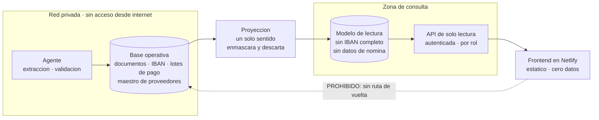

# Portal de consulta

Una página donde el contable, un cliente o un trabajador puedan ver
movimientos, facturas y las horas que hay detrás.

> **Es el componente de mayor riesgo del proyecto.** Todo lo demás vive dentro
> de vuestra red. Esto es una puerta a internet delante de las cuentas de la
> empresa, los datos bancarios de los proveedores y las horas y ubicaciones de
> los trabajadores. La arquitectura de abajo existe para que, si esa puerta
> cede, lo que hay detrás no valga gran cosa.

---

## La decisión que lo cambia todo

**No pongas una API delante de la base de datos operativa. Construye un modelo
de lectura aparte, deliberadamente pobre.**

Es la misma idea de zonas de confianza del resto del sistema. El portal no
puede filtrar un IBAN si en la base que consulta no hay ningún IBAN.

La proyección escribe y nunca lee de vuelta. El frontend no tiene
credenciales de base de datos. La API no tiene permiso de escritura en
ninguna parte.

---

## Las cuatro capas

### 1. Base operativa, privada

Todo lo que ya tenéis: documentos originales, extracciones, IBAN, lotes de
pago, maestro de proveedores. **Sin acceso desde internet, ni siquiera de
lectura.** Solo la alcanza el agente.

### 2. Proyección

Un proceso que copia al modelo de lectura únicamente lo que se puede enseñar,
ya despojado:

- El IBAN se enmascara **aquí**, no en la pantalla. Se guardan los cuatro
  últimos dígitos y nada más.
- El documento original no se copia. Se referencia.
- Los datos personales que el portal no necesita no salen de la zona
  operativa.

Es un proceso de un solo sentido. No existe código que lea del modelo de
lectura hacia la base operativa.

### 3. Modelo de lectura y API

Postgres separado, con su propio usuario de base de datos que tiene `SELECT`
y nada más. La API es de solo lectura por construcción, no por disciplina.

Lo que sirve depende del rol:

| Rol | Ve |
| --- | --- |
| Administración | Todo el modelo de lectura, con los resultados de validación |
| Contable | Lo fiscal, sin datos personales que no necesite |
| Cliente | Solo sus propias facturas y las horas que las sostienen |
| Trabajador | Solo sus propias horas |

**La API nunca devuelve un IBAN completo.** Enmascarar en el navegador no es
enmascarar: cualquier cosa que llegue al cliente es visible para quien sepa
abrir las herramientas de desarrollo, por mucho que la interfaz la tape.

### 4. Frontend en Netlify

Estático puro: HTML, CSS y JavaScript. **Cero datos en el bundle.** Netlify
sirve ficheros públicos, así que cualquier dato que metas en el build lo tiene
quien conozca la URL.

El frontend autentica al usuario y pide a la API. No sabe nada de la base de
datos.

---

## Autenticación

Usad **Entra ID** vía OIDC si estáis en Microsoft 365, que es lo más probable.
Ventajas concretas: las cuentas ya existen, las bajas de personal se propagan
solas, y el segundo factor lo gestiona quien ya lo gestiona.

Alternativas razonables si no: Auth0 o Clerk. **Nunca un login propio.** Un
sistema de contraseñas casero delante de datos financieros es trabajo que no
hay que hacer y riesgo que no hay que asumir.

Clientes y trabajadores externos no van a estar en vuestro Entra: para ellos,
enlaces mágicos por correo con caducidad corta, o invitación como usuarios
invitados.

---

## Verificar la veracidad de una factura

Esto es lo que convierte el portal en una herramienta y no en un visor. Por
cada factura se muestra:

- Qué reglas del [catálogo](validacion-facturas.md) pasaron y cuáles no, con
  los valores que se compararon.
- Las horas del planning que sostienen cada línea, hasta el turno concreto.
- El PDF original, para los roles autorizados.

Eso último con cuidado: el PDF se sirve con una **URL firmada de corta
duración**, generada por la API tras comprobar el rol, nunca como enlace
público. Y cada apertura se registra.

La cadena de procedencia que ya guarda la fase 0 es justo lo que hace posible
esta pantalla. Si no se hubiera guardado en su momento, aquí no se podría
reconstruir.

---

## Lo que descarté y por qué

| Opción | Por qué no |
| --- | --- |
| Datos en el bundle estático de Netlify | Cualquiera con la URL los tiene. Netlify sirve ficheros públicos. |
| Supabase con RLS sobre la base operativa | Las políticas de seguridad por fila son sutiles y un fallo expone filas reales. Poner la base financiera detrás de un endpoint público es superficie que no hace falta. Supabase sí sirve para la zona de consulta, que es pobre a propósito. |
| Funciones de Netlify con credenciales de la base operativa | Mete las credenciales de producción en el entorno del hosting y acopla la seguridad al proveedor de la web. |
| Un solo Postgres con vistas restringidas | Mejor que nada, pero un fallo en la API llega a la misma base donde están los IBAN. La separación física es lo que acota el daño. |

---

## Escalabilidad

Sale gratis con esta forma. El modelo de lectura es de solo lectura y
cacheable, así que escala solo. La base operativa **nunca recibe tráfico web**,
que es lo que normalmente tumba este tipo de sistemas.

---

## Dos reglas permanentes

1. **El portal nunca gana un botón.** Si algún día hay que aprobar algo, eso
   va en una herramienta interna detrás de Entra con segundo factor, no en una
   página pública. En el momento en que el portal pueda escribir, toda esta
   arquitectura deja de servir para nada.
2. **Cada lectura se registra**: quién, qué y cuándo. Es obligación de AVG y es
   lo que permite responder si alguien pregunta quién vio qué.

---

## Cuándo

Después de la fase 2, de forma realista: hasta que no haya facturas de venta
emitidas y facturas de compra contabilizadas, no hay nada que enseñar.

Lo que sí hay que hacer **ahora** es no cerrarse la puerta, y eso ya está
hecho: el modelo de datos de la fase 0 guarda la procedencia línea a turno,
que es exactamente lo que este portal necesita.
